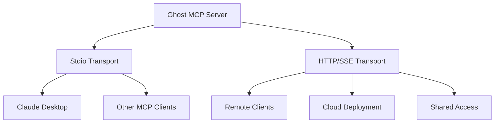

# Deployment Overview

Ghost MCP supports two transport modes, each suited for different deployment scenarios.

## Transport Modes



| Transport | Use Case | Protocol |
|-----------|----------|----------|
| **Stdio** | Local development, single-user | stdin/stdout |
| **HTTP/SSE** | Remote access, multi-user, cloud | HTTP + Server-Sent Events |

## Quick Comparison

| Feature | Stdio | HTTP/SSE |
|---------|-------|----------|
| Setup complexity | Minimal | Moderate |
| Network required | No | Yes |
| Multiple clients | No | Yes |
| Authentication | N/A | Via reverse proxy |
| Best for | Local dev | Production |

## Prerequisites

- Node.js 18 or higher
- npm 9 or higher
- A Ghost site with API access configured
- API keys from Ghost Admin (see [Getting Started](../getting-started.md))

## Building from Source

```bash
git clone https://github.com/workspace/ghost-mcp.git
cd ghost-mcp
npm install
npm run build
```

This compiles the TypeScript source to JavaScript in the `dist/` directory.

## Deployment Guides

- [Local Stdio](./local-stdio.md) — Claude Desktop integration
- [Remote SSE](./remote-sse.md) — HTTP/SSE endpoints and session management
- [Docker](./docker.md) — Container deployment
- [Systemd & Nginx](./systemd-nginx.md) — Linux service with reverse proxy
- [Cloud](./cloud.md) — Railway, Render, Fly.io, and serverless
- [Production](./production.md) — Security, performance, and monitoring
