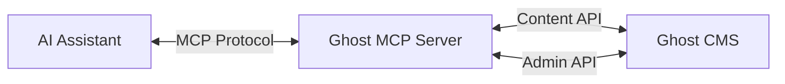

# Introduction

**Ghost MCP** is an [MCP (Model Context Protocol)](https://modelcontextprotocol.io/) server for interacting with [Ghost CMS](https://ghost.org/) blogs through AI assistants like Claude.

## What is Ghost MCP?

Ghost MCP bridges the gap between AI assistants and Ghost CMS by implementing the Model Context Protocol. This allows AI tools to:

- **Read content** via the Content API — browse posts, pages, tags, and authors
- **Manage content** via the Admin API — create, update, and delete posts, pages, tags, members, newsletters, tiers, offers, webhooks, and more
- **Deploy flexibly** — run locally via stdio or remotely via HTTP/SSE

## Architecture

## Key Features

| Feature | Description |
|---------|-------------|
| **Content API** | 8 read-only tools for browsing and reading content |
| **Admin API** | 46 tools for full CRUD operations |
| **Dual Transport** | stdio for local, HTTP/SSE for remote deployment |
| **NQL Filters** | Full support for Ghost's query language |
| **TypeScript** | Fully typed codebase with Zod validation |

## Quick Links

- [Getting Started](./getting-started.md) — Set up Ghost MCP in under 5 minutes
- [Tools Reference](./tools/content-api.md) — Browse all available tools
- [Deployment Guide](./deployment/overview.md) — Deploy to production
- [Usage Examples](./examples/content-api-examples.md) — Real-world usage patterns
